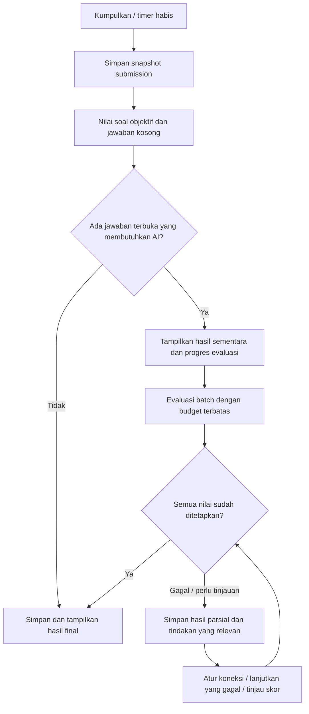

# Task Plan: Tipe Soal Beragam dan Manajemen Evaluasi AI

Tanggal: 9 Oktober 2026  
Proyek: QuizMind AI  
Status: Fitur utama telah diimplementasikan; bukti, penyesuaian desain, dan butir yang belum diverifikasi tercatat di ../implementation/2026-10-09-assessment.md.  
Dasar: Pemeriksaan kode proyek, instruksi pengguna, serta dokumentasi resmi aksesibilitas dan keluaran terstruktur AI.

## 1. Tujuan dan ruang lingkup

Mendukung tujuh tipe soal dalam satu sistem kuis, memperluas pilihan ganda menjadi lima opsi, dan menambahkan evaluasi jawaban terbuka yang dapat dikelola melalui Pengaturan AI/Koneksi AI. Pengalaman membuat kuis, mengerjakan, menerima penilaian, membuka riwayat, dan mencetak hasil harus konsisten di seluruh tipe.

### Permintaan yang sudah pasti

- Pilihan ganda biasa menggunakan **5 opsi A–E**, dengan satu jawaban benar.
- Pilihan ganda kompleks menggunakan **5 opsi A–E**, dengan beberapa jawaban benar. Bentuk checkbox ini telah dikonfirmasi pengguna.
- Tambahkan benar/salah, isian singkat, esai, menjodohkan, dan mengurutkan.
- Isian singkat dan esai membutuhkan dukungan evaluasi AI.
- Tambahkan manajemen evaluasi pada pengaturan AI; pemilihan model evaluasi harus dapat berbeda dari model pembuat soal.
- Rencana mencakup interaksi UI, validasi, penilaian, kompatibilitas data, dan verifikasi.

### Default rancangan yang diusulkan

Default berikut merupakan keputusan rancangan untuk membuat backlog konkret, belum merupakan preferensi tambahan yang dikonfirmasi pengguna. Simpan sebagai konfigurasi yang dapat diubah pada batas yang dijelaskan di bawah.

| Area | Default implementasi |
| --- | --- |
| Bentuk kuis | Satu tipe atau campuran dengan jumlah per tipe; total tetap 1–100 soal |
| Pilihan ganda kompleks | 2–4 opsi benar dari 5 opsi; peserta boleh memilih 0–5 opsi tanpa membocorkan jumlah kunci |
| Benar/salah | Satu pernyataan per soal; jawaban awal kosong, bukan otomatis salah |
| Menjodohkan | 3–8 pasangan, satu-ke-satu, tanpa opsi pengalih pada versi pertama |
| Mengurutkan | 3–8 item dengan satu urutan yang dapat dibuktikan benar |
| Isian singkat | Maksimal 500 karakter; pemeriksaan alias yang benar dapat lokal, jawaban semantik dievaluasi AI |
| Esai | Maksimal 5.000 karakter; AI menilai dengan rubrik yang dibekukan sebelum pengerjaan |
| Bobot awal | Setiap soal bernilai 1 poin; bobot berbeda per tipe tersedia di pengaturan lanjutan |
| Kredit parsial | PG kompleks dan mengurutkan: bawaan semua-atau-nol; menjodohkan: per pasangan; isian/esai: sesuai rubrik |
| Evaluasi AI | Aktif untuk kuis yang memuat jawaban terbuka; pencarian web evaluasi bawaan nonaktif |
| Model evaluator | Awalnya mengikuti pilihan pembuat soal sampai pengguna menentukan profil evaluator tersendiri |
| Cadangan evaluator | Perpindahan model/penyedia bawaan nonaktif dan diatur terpisah dari generator |
| Kondisi gagal | Hasil objektif tetap tersedia; jawaban terbuka tetap tersimpan dengan status menunggu/gagal evaluasi |
| Penggunaan | Latihan belajar pribadi sesuai aplikasi saat ini; belum menjadi sistem ujian resmi dengan akun peserta/guru |

Peningkatan berikut tidak menjadi prasyarat: akun guru/peserta, bank soal bersama, editor soal penuh, upload jawaban berbentuk file/gambar, proctoring, penilaian plagiarisme, dan esai dengan rich text. Gunakan textarea teks biasa pada implementasi awal.

## 2. Kondisi proyek dan titik perubahan

Pemeriksaan dilakukan pada source saat rencana ini dibuat. Nama file pada dokumen menggunakan path relatif terhadap root repository agar dokumen tetap portabel.

| File/area saat ini | Temuan | Perubahan yang diperlukan |
| --- | --- | --- |
| `src/types/quiz.ts` | `Question` tunggal; opsi 4; satu `correctAnswerIndex`; jawaban berupa angka | Union soal/jawaban, versi skema, poin, rubrik, evaluasi per soal |
| `src/quizConfig.ts` | Validasi topik, jumlah, model, timer; belum ada distribusi tipe | Validasi komposisi, bobot, kebijakan penilaian dan kesiapan evaluator |
| `src/server/quizPipeline.ts` | Prompt, JSON schema, dan validator mewajibkan 4 opsi | Kontrak dan validator per tipe; soal baru mewajibkan 5 opsi |
| `src/server/geminiService.ts` | Memakai pipeline bersama dan prompt Gemma khusus yang juga masih 4 opsi | Perbarui kedua jalur prompt, batching, validasi dan pencatatan tipe |
| `src/server/groqService.ts` | Generasi batch sampai 5 soal; pencarian web sebelum generasi | Generasi per tipe dengan distribusi tepat; evaluator tidak mewarisi pencarian wajib generator |
| `src/server/aiService.ts` | Adapter Gemini/Groq dan kebijakan fallback untuk generasi | Tambahkan adapter evaluasi dengan kebijakan tersendiri |
| `src/api.ts` | Mode browser langsung hanya menangani health/generate; ada lock generasi | Routing evaluate/cancel/progress dan lock pekerjaan AI yang konsisten |
| `server.ts` | Express menyediakan `/api/generate-quiz`; vault server dapat memakai stream NDJSON | Endpoint evaluasi, autentikasi, pembatasan pekerjaan dan stream progres |
| `worker.ts` | Worker hanya menerima endpoint generasi | Dukungan evaluasi sesuai batas runtime Worker dan mode browser |
| `src/keyPool.ts` | Key/model/provider/cooldown bersama; settings belum memiliki profil evaluasi | Profil evaluasi, validasi/migrasi settings, budget percobaan lintas fallback |
| `src/components/PersonalKeyManager.tsx` | Tab overview, keys, models, storage | Tab Evaluasi AI dan penyimpanan profil tanpa menyalin secret |
| `src/components/AIConnectionsModal.tsx` | Modal Koneksi AI dengan busy/dirty handling | Integrasi tab evaluator, status uji evaluator, pesan penyimpanan |
| `src/components/QuizCreator.tsx` | Belum ada tipe soal/komposisi | Pilihan tipe, komposisi, bobot, ringkasan dan kesiapan evaluator |
| `src/components/QuizRunner.tsx` | State angka, input radio, jumlah jawaban dari jumlah key, deadline absolut | Renderer per tipe, deteksi lengkap/parsial, penyimpanan draft dan submit aman |
| `src/App.tsx` | Penilaian sinkron berdasarkan index; riwayat v1 menyimpan `lastResult` | Orkestrasi penilaian lokal+AI, state asinkron, attempt baru, migrasi riwayat |
| `QuizResults.tsx` / `QuizHistoryView.tsx` | Hasil mengasumsikan opsi/index dan skor final | Review per tipe, poin parsial, hasil sementara, retry dan retake eksplisit |
| `scripts/*-test.ts` | Tes key/provider dan fixture 4 opsi | Pisahkan fixture legacy dari fixture baru; tes tipe/evaluator/hasil |

Catatan aturan: `.agents/rules/anti-loop.md` sudah tersedia dengan frontmatter `trigger: always_on`. Pertahankan aturan tersebut. Dokumen rencana lama di `.aistudio/artifacts/.../implementation_plan.md` menyebut 4 opsi; dokumen itu merupakan catatan implementasi terdahulu. Spesifikasi fitur baru ini menggunakan 5 opsi tanpa mengubah soal lama.

## 3. Prinsip desain dan kriteria keberhasilan

1. **Kontrak data mendahului UI.** Setiap tipe mempunyai struktur soal, jawaban, validasi, dan evaluator yang eksplisit.
2. **Penilaian objektif tidak membutuhkan API AI.** AI digunakan untuk jawaban terbuka yang memerlukan pemahaman makna/rubrik.
3. **Kunci dan rubrik dibekukan sebelum pengerjaan.** AI tidak membuat ulang standar jawaban saat melihat jawaban peserta.
4. **Tidak ada kehilangan jawaban karena penilaian gagal.** Simpan snapshot submission sebelum panggilan evaluator.
5. **Status penilaian jujur.** Pending, gagal, dan perlu tinjauan berbeda dari salah atau belum dijawab.
6. **UI dapat dipakai dengan tap/klik dan keyboard.** Drag-and-drop hanya peningkatan opsional setelah kontrol dasar lulus verifikasi.
7. **Mendukung tiga jalur yang sudah ada:** browser langsung dengan key pribadi/GitHub Pages, Node/Express, dan Worker.
8. **Migrasi menjaga riwayat lama.** Soal lama dengan empat opsi tetap empat opsi; jangan membuat opsi kelima palsu.

### Kriteria keberhasilan utama

- Tujuh tipe dapat dibuat, dikerjakan, dinilai, dibuka kembali, dan dicetak sesuai kontrak masing-masing.
- Semua soal PG/PG kompleks baru memiliki tepat lima opsi unik; PG biasa satu kunci, PG kompleks 2–4 kunci unik.
- Kuis campuran menghasilkan jumlah total dan jumlah per tipe yang persis sesuai permintaan.
- Tidak ada panggilan AI saat peserta mengetik, memilih opsi, berpindah nomor, atau membuka ulang hasil yang telah selesai.
- Jawaban benar/salah bernilai `false` serta opsi index `0` tidak dianggap kosong.
- Submit ganda, pergantian tab, timer habis, reload, dan respons terlambat tidak membuat penilaian/hasil tercampur antar-attempt.
- Error evaluator tidak mengubah jawaban terbuka menjadi salah dan tidak menampilkan skor final palsu.
- Riwayat v1 serta vault/settings lama berhasil dibuka setelah migrasi.
- Tidak ada API key, kata sandi, atau isi jawaban peserta dalam log/error umum.
- Pemeriksaan TypeScript, build, tes regresi relevan, tes fitur, dan QA UI lulus sebelum fitur dinyatakan selesai.

## 4. Kontrak data yang direncanakan

### 4.1 Tipe soal dan kunci

Gunakan discriminated union TypeScript dengan `type`, bukan satu interface berisi banyak properti opsional. Tambahkan validator runtime; tipe TypeScript saja tidak memvalidasi respons AI atau localStorage.

| `QuestionType` | Data khusus | Kunci/standar penilaian |
| --- | --- | --- |
| `single_choice` | `options: { id, text }[]` | `correctOptionId` |
| `multiple_select` | `options: { id, text }[]` | `correctOptionIds: string[]` dan `scoringMode` |
| `true_false` | Pernyataan pada `question` | `correctValue: boolean` |
| `short_answer` | `answerPolicy`, `maxLength` | `acceptedAnswers`, jawaban acuan, konsep wajib, aturan angka/unit bila relevan |
| `essay` | `maxLength`, panduan panjang opsional | Jawaban contoh, rubric dengan ID kriteria, deskripsi dan anchor level |
| `matching` | `leftItems`, `rightItems` | `correctPairs: Record<leftId, rightId>` |
| `ordering` | `items: { id, text }[]` | `correctOrder: string[]` dan `scoringMode` |

Field bersama: `id`, `type`, `question`, `explanation`, `groundingSources`, `topicCategory`, `maxPoints`, dan `schemaVersion` pada container kuis. Pertahankan metadata provider/model generator yang sudah ada.

Aturan ID: stabil dalam satu kuis, unik, tidak berasal dari label A/B/C atau posisi array. Pengacakan tampilan mempertahankan ID dan kunci. Untuk menjodohkan, ID kiri/kanan memakai namespace berbeda. Untuk urutan, jawaban selalu menyimpan ID item, bukan teks yang berpotensi sama.

### 4.2 Struktur jawaban peserta

```typescript
type AnswerValue =
  | { type: 'single_choice'; selectedOptionId: string | null }
  | { type: 'multiple_select'; selectedOptionIds: string[] }
  | { type: 'true_false'; value: boolean | null }
  | { type: 'short_answer'; text: string }
  | { type: 'essay'; text: string }
  | { type: 'matching'; pairs: Record<string, string> }
  | { type: 'ordering'; orderedItemIds: string[]; confirmed: boolean };

type AnswerProgress = 'unanswered' | 'partial' | 'complete';
```

`type` jawaban harus cocok dengan soal. Gunakan helper bersama `getAnswerProgress(question, answer)`, `validateAnswer(question, answer)` dan `isBlankAnswer(...)` pada runner, submit, review, dan migrasi. Jangan menentukan jumlah terjawab hanya dari `Object.keys(answers).length` atau truthiness.

- PG biasa lengkap setelah satu pilihan; PG kompleks setelah minimal satu pilihan, tanpa memaksa minimal dua pilihan di UI.
- Benar/salah lengkap jika value tepat `true` atau `false`.
- Teks berisi whitespace saja dianggap kosong; teks yang sudah diisi tetap sah dikirim walaupun secara konsep salah.
- Menjodohkan parsial bila baru sebagian kiri memperoleh pasangan; submission parsial tetap boleh dikirim.
- Urutan awal adalah tampilan belum terjawab. Pertukaran item mengonfirmasi jawaban; sediakan **Gunakan urutan ini** jika peserta merasa tampilan awal sudah benar. Menghapus jawaban mengembalikan `confirmed: false`.

### 4.3 Submission, attempt, evaluasi dan hasil

- `QuizSubmission` baru: `submissionId`, `attemptId`, `quizId`, `schemaVersion`, `answers`, `bookmarkedQuestions`, `startedAt`, `submittedAt`, `timeTakenSeconds`, dan `submitReason: manual | timer`.
- Snapshot jawaban immutable setelah submit. Retake menghasilkan `attemptId` baru; respons AI attempt lama tidak boleh mengubah attempt baru.
- `QuestionEvaluation`: `questionId`, `status`, `method: deterministic | ai | manual`, `earnedPoints`, `maxPoints`, `feedback`, skor per kriteria, flag tinjauan, error aman, dan provenance evaluasi.
- Status per soal: `unanswered`, `pending`, `evaluating`, `graded`, `needs_review`, `failed`, `cancelled`. Benar/parsial/salah diturunkan dari poin hanya pada evaluasi yang selesai.
- `earnedPoints: null` untuk pending/failed/cancelled/needs_review yang belum ditetapkan; **0** untuk kosong atau jawaban yang telah dinilai salah.
- `QuizResult`: daftar evaluasi per soal, jumlah poin terkonfirmasi, total poin, `finalScore: number | null`, status agregat, jumlah benar/parsial/salah/kosong/belum dinilai, dan ringkasan belajar.
- Simpan `evaluationProfileSnapshot`, `rubricVersion`, `promptVersion`, provider/model diminta dan aktual, waktu evaluasi, `attemptCount`, durasi, usage token bila tersedia, dan `evaluationRevision`.
- Jawaban/model/rubrik/config hash menjadi identitas cache. Hash saja tidak menjadi kontrol autentikasi.
- Pada hasil sementara tampilkan **Poin terkonfirmasi X dari Y total; Z soal belum dinilai**. Final score baru tersedia ketika semua soal mempunyai poin final.
- `evaluationAnalysis` saat ini merupakan ringkasan berdasarkan skor lokal. Pada fase awal gunakan ringkasan lokal + feedback evaluator; jangan menambah panggilan AI kedua hanya untuk paragraf ringkasan.

### 4.4 Konfigurasi dan distribusi

- Tambahkan `questionDistribution: Partial<Record<QuestionType, number>>`; jumlah per tipe harus integer nonnegatif dan jumlahnya tepat `questionCount`.
- Konfigurasi tanpa distribusi dinormalisasi menjadi seluruh soal `single_choice` untuk kompatibilitas permintaan lama.
- Bobot per tipe merupakan integer positif 1–20, default 1; jumlah `maxPoints` tidak boleh nol.
- `scoringPolicy` disimpan pada kuis; perubahan pengaturan tidak menilai ulang hasil lama secara diam-diam.
- `timePerQuestionByType` opsional untuk mode sekuensial. Default usulan: objektif 60 detik, PG kompleks/menjodohkan/mengurutkan 90 detik, isian 90 detik, esai 300 detik; semua bisa diubah 15–600 detik atau tanpa batas.
- Pertahankan mode timer total. Timer pengerjaan berhenti saat submit; waktu menunggu AI tidak dihitung sebagai waktu mengerjakan.
- Validasi batas panjang dilakukan tanpa pemotongan jawaban peserta secara diam-diam; tampilkan pesan dan pertahankan isi draft.

## 5. Penilaian dan rubrik

### 5.1 Penilaian deterministik

| Tipe | Default | Opsi kredit parsial dan catatan |
| --- | --- | --- |
| PG biasa | Semua poin jika ID cocok; selain itu 0 | Tidak ada parsial |
| PG kompleks | Set pilihan tepat sama dengan set kunci mendapat semua poin | Opsional: `max(0, benarDipilih/totalBenar - salahDipilih/totalSalah) * maxPoints`; duplikat/ID asing ditolak |
| Benar/salah | Boolean cocok mendapat semua poin | `false` adalah jawaban sah; `null` kosong |
| Menjodohkan | `pasanganBenar / jumlahKiri * maxPoints` | Pasangan yang belum diisi mendapat 0 pada bagian itu; set mapping sempurna mendapat semua poin |
| Mengurutkan | Seluruh urutan tepat mendapat semua poin | Opsional: rasio pasangan item dengan urutan relatif benar terhadap `n*(n-1)/2`; bukan hanya posisi item yang benar |

PG kompleks dengan memilih semua opsi mendapat 0 pada formula parsial; jangan memberi keuntungan karena menebak semuanya. Batas hasil selalu 0–`maxPoints`. Gunakan presisi internal konsisten, misalnya empat desimal; pembulatan tampilan poin dua desimal dan skor akhir dua desimal hanya pada akhir agregasi.

Urutan yang belum dikonfirmasi adalah kosong. Pada parsial ordering, evaluasi hanya permutation lengkap yang valid. Soal dengan beberapa urutan sama-sama benar ditolak oleh kontrak versi pertama; pembuat soal diminta menggunakan urutan yang tegas.

### 5.2 Isian singkat

- Simpan jawaban acuan, alias sah, konsep inti, sinonim yang diperbolehkan, dan aturan kepekaan huruf/tanda baca pada soal.
- Normalisasi aman: Unicode NFC, trim, dan spasi berulang. Case folding/tanda baca hanya bila aturan soal mengizinkan; jangan membuang negasi, simbol, unit, atau tanda minus.
- Angka/unit memakai aturan khusus soal yang tervalidasi: locale desimal, unit wajib/alias, toleransi absolut/relatif. Tidak menerapkan toleransi angka ke soal teks umum.
- Mode default **hibrida**: alias sah yang cocok dapat memperoleh poin lokal; mismatch dialihkan ke AI, tidak otomatis salah.
- Mode **AI penuh** tersedia bila pengguna ingin semua jawaban nonkosong dinilai evaluator yang sama. Kosong tetap 0 lokal tanpa panggilan API.
- Rubrik isian default berskala 0, 0,5, 1 dari `maxPoints`; 0,5 hanya untuk kriteria yang memang mengizinkan jawaban sebagian benar.
- Umpan balik menjelaskan konsep yang terpenuhi/kurang dan perbedaan dari jawaban acuan, bukan kesamaan kata semata.

### 5.3 Esai

- AI pembuat soal menghasilkan 3–5 kriteria rubrik dengan deskripsi, bobot/kontribusi, dan anchor skor: tidak terpenuhi, sebagian, terpenuhi.
- Default usulan: ketepatan konsep 40%, cakupan unsur wajib 30%, penalaran/contoh 20%, kejelasan 10%. Rubrik boleh menyesuaikan jenis pertanyaan; jangan memaksa contoh bila pertanyaan tidak meminta contoh.
- Jumlah bobot tepat 100%; aplikasi mengonversi skor kriteria ke `maxPoints`, bukan meminta AI menentukan skor total bebas.
- Jangan mengurangi skor karena panjang singkat, ejaan, atau gaya bahasa kecuali kriteria soal menyatakannya. Saran jumlah kata bersifat panduan, bukan validasi yang memblokir submit.
- Terima argumen alternatif yang sesuai konsep dan didukung penalaran; jawaban contoh bukan satu-satunya susunan kata yang benar.
- Output evaluator memuat skor tiap kriteria, kutipan pendek dari jawaban peserta yang mendukung skor, unsur belum terpenuhi, dan saran perbaikan. Verifikasi kutipan memang ada pada teks peserta.
- Tidak meminta atau menampilkan chain-of-thought internal; feedback berupa alasan penilaian ringkas yang dapat ditinjau.

### 5.4 Kualitas dan tinjauan

- AI self-confidence tidak dianggap probabilitas kebenaran. Jika ditampilkan, beri label sinyal penilaian dan jangan menjadi satu-satunya dasar finalisasi.
- `needs_review` dipicu oleh kontradiksi, rujukan/rubrik tidak cukup, flag manipulasi instruksi, bukti yang tidak cocok, atau perbedaan penilaian signifikan pada audit yang diizinkan.
- Pada latihan pribadi, sediakan **Tinjau penilaian**: lihat rubrik, alasan dan jawaban; pengguna dapat menerima skor usulan atau menetapkan skor manual dengan alasan.
- Simpan skor AI awal, perubahan manual, alasan dan timestamp; tampilkan label **Disesuaikan pengguna**. Ini bukan proses persetujuan guru karena sistem belum memiliki peran guru/peserta.
- Penilaian ulang eksplisit membuat revision baru, mempertahankan revision sebelumnya. Hanya soal yang dipilih boleh dievaluasi ulang dan perlu menjelaskan bahwa tindakan memakai kuota.

## 6. Interaksi UI dari awal sampai hasil

### 6.1 Pembuat kuis

1. Tambahkan bagian **Tipe soal** setelah materi/topik: pilihan **Satu tipe** dan **Campuran**.
2. Mode satu tipe: pilih salah satu dari tujuh tipe; jumlah soal memakai kontrol yang sudah ada.
3. Mode campuran: checkbox tipe, input jumlah per tipe, total live, dan tombol **Bagi merata**. Jumlah menjadi sumber kebenaran; total dihitung dari distribusi dan tetap dibatasi 1–100.
4. **Bagi merata** memakai pembagian integer dan sisa dalam urutan tipe tetap, sehingga hasil dapat diprediksi. Menghapus tipe tidak memindahkan jatah ke tipe lain secara diam-diam.
5. Contoh instruksi singkat tiap tipe ditampilkan tanpa bocoran jawaban. PG kompleks: “Pilih semua jawaban yang benar; bisa lebih dari satu.”
6. Bobot, parsial, batas karakter, dan timer per tipe berada dalam **Pengaturan penilaian & waktu** yang dapat dibuka; default tetap mudah dipakai.
7. Bila ada isian/esai, tampilkan ringkasan **Dinilai AI setelah dikumpulkan**, model evaluator, kesiapan key, dan tautan **Kelola Evaluasi AI**.
8. Jika evaluator tidak siap: pengguna tetap bisa mengisi form; aksi membuat kuis menjelaskan **Atur evaluator** atau pilihan eksplisit **Lanjutkan; evaluasi nanti**. Tidak membuang konfigurasi form.
9. Ringkasan sebelum buat memuat distribusi, total poin, waktu, generator, evaluator dan kebijakan parsial. Hindari memberi jaminan durasi/biaya uang tanpa data resmi.
10. Pesan error per field disertai ringkasan yang bisa memindahkan fokus; tombol utama menjelaskan alasan belum dapat dipakai.

### 6.2 Pengerjaan per tipe

| Tipe | Kontrol dan bantuan | State/edge case |
| --- | --- | --- |
| PG biasa | Lima radio; seluruh label dapat diklik; A–E mengikuti tampilan | Tidak otomatis pindah soal; tombol hapus jawaban tersedia |
| PG kompleks | Lima checkbox; petunjuk “pilih semua yang benar”; counter pilihan opsional | Boleh batal centang; jangan tampilkan jumlah kunci benar |
| Benar/salah | Dua radio berlabel teks jelas | Awal keduanya kosong; jangan gunakan toggle dengan default false |
| Isian singkat | Input/textarea pendek, label dan counter karakter | Enter tidak mengumpulkan seluruh kuis tanpa sengaja; paste/IME didukung |
| Esai | Textarea auto-height sampai batas viewport; counter; rubrik peserta tanpa jawaban contoh | Ctrl/Meta+Enter bukan submit bawaan; autosave tidak menggeser caret/scroll |
| Menjodohkan | Pilih item kiri, lalu kanan; setiap kiri juga mempunyai dropdown aksesibel | Pasangan dapat diubah/hapus; kanan yang sudah dipakai ditandai dan ditolak untuk kiri lain; pindah pasangan eksplisit |
| Mengurutkan | List bernomor dengan tombol Naik/Turun; pilih item lalu tujuan posisi bila perlu | Fokus mengikuti item yang bergerak; ada konfirmasi urutan awal dan reset jawaban |

Untuk matching, desktop dapat menampilkan dua kolom dan garis penghubung sebagai dekorasi. Mobile memakai pasangan bertumpuk/dropdown tanpa scroll horizontal. Jangan mengandalkan warna atau garis untuk menjelaskan hasil/pasangan.

Untuk ordering, drag handle boleh ditambahkan kemudian; kontrol Naik/Turun harus tetap tersedia di semua perangkat. Drag yang dibatalkan atau hanya mengambil item tidak menandai soal terjawab. Stabilkan pengacakan saat attempt dibuat, bukan saat render.

### 6.3 Navigasi, penyimpanan dan timer

- Nomor soal menampilkan belum dijawab, sebagian, lengkap, dan ragu dengan teks/ikon yang tidak bergantung warna.
- Mode bebas memungkinkan revisi semua jawaban sebelum submit. Mode sekuensial mempertahankan penguncian soal sebelumnya seperti perilaku saat ini, dengan penjelasan sebelum mulai.
- Deadline absolut tetap dipakai; durasi aktif mengikuti tipe soal dan tidak direset oleh rerender.
- Saat timer habis, simpan teks terakhir yang sudah masuk serta pasangan parsial, hentikan interaksi, dan buat satu submission. Tangani IME/paste/blur dan event input yang bertepatan dengan deadline secara konsisten.
- Tidak memblokir akhir kuis karena jawaban kosong/parsial. Konfirmasi manual menyebut jumlah kosong dan parsial; timer submit otomatis tidak menunggu dialog.
- Autosave draft debounced sekitar 500 ms dengan flush saat pindah soal, pagehide dan submit. Utamakan buffer in-memory sinkron untuk nilai terbaru; jangan mengandalkan debounce saat timer habis.
- Simpan draft ke IndexedDB melalui modul penyimpanan terpisah; riwayat v1 dimigrasi secara aman. Tangani penyimpanan diblokir/kuota penuh dengan status **Belum tersimpan** dan opsi ekspor jawaban teks/JSON.
- Refresh menyediakan **Lanjutkan pengerjaan** dengan deadline semula atau **Mulai ulang** sebagai attempt baru. Jika deadline telah lewat, finalisasi sesuai kebijakan timer tanpa memberikan waktu tambahan.
- Gunakan mekanisme kepemilikan attempt/tab dan pemberitahuan tab lain; satu attempt tidak boleh ditulis bersamaan oleh dua tab. Kuis yang disubmit tetap dapat dilihat di tab lain sebagai read-only.

### 6.4 Pengumpulan dan proses evaluasi



Progres berasal dari event nyata, misalnya “3 dari 5 jawaban selesai dinilai”. Jangan mengarang persentase kemajuan berdasarkan waktu. Menutup halaman membatalkan pekerjaan browser yang belum selesai; resume tidak memanggil ulang soal yang sudah dinilai. **Batalkan evaluasi** mempertahankan submission dan nilai yang sudah selesai.

### 6.5 Hasil, riwayat dan cetak

- Hasil memisahkan benar penuh, parsial, salah, kosong, menunggu, perlu tinjauan, dan gagal evaluasi.
- Setiap kartu memakai renderer review sesuai tipe: opsi dipilih/kunci, pasangan peserta/kunci, urutan peserta/kunci, atau teks+rubrik+feedback.
- Tampilkan nilai `earnedPoints/maxPoints`; statistik poin berbeda dari persentase jumlah jawaban benar penuh. Hapus istilah akurasi yang dapat disalahartikan pada kuis campuran atau definisikan denominator secara jelas.
- Evaluasi AI menunjukkan model aktual dan waktu penilaian; fallback terlihat pada provenance hasil, tanpa key atau detail internal sistem.
- Hasil sementara mempunyai aksi **Lanjutkan evaluasi yang belum selesai**, **Kelola Evaluasi AI**, dan **Tinjau penilaian** hanya bila relevan.
- Riwayat menampilkan komposisi tipe dan status penilaian. Bedakan **Lihat hasil**, **Lanjutkan pengerjaan**, dan **Kerjakan ulang**; saat ini tombol Kerjakan dapat membuka hasil lewat `App.tsx`, sehingga perilaku perlu dibuat eksplisit.
- Retake mempertahankan soal/rubrik, membuat attempt baru, mengosongkan jawaban, mengacak tampilan secara stabil, dan tidak menimpa hasil attempt lama.
- Cetak memuat soal, jawaban peserta, kunci/rubrik, poin dan status final/sementara. Teks esai dibungkus, tidak terpotong; pasangan/urutan dapat dibaca tanpa garis interaktif.

### 6.6 Aksesibilitas dan responsivitas

- Gunakan kontrol native bila tersedia: radio, checkbox, textarea, select, button; label/legend/description terhubung.
- Keyboard: Tab terurut, Space untuk checkbox, panah radio native; kontrol matching/ordering memberi fokus dan pengumuman state yang jelas.
- Status evaluasi dan perpindahan pasangan/posisi memakai `aria-live=polite`; timer tidak dibacakan setiap 250 ms. Pengingat waktu cukup pada ambang relevan.
- Error terhubung lewat `aria-describedby`/`aria-invalid`; fokus menuju field pertama setelah validasi submit form gagal, bukan saat peserta sedang mengetik.
- Target interaksi diusulkan minimal 44×44 CSS px; visible focus, kontras memadai, reduced motion, dan zoom 200%.
- QA pada 360 px, 768 px, 1280 px dan keyboard-only. Matching/ordering harus berfungsi dengan klik/tap tanpa drag serta keyboard.
- Alternatif tanpa drag mengikuti [W3C WCAG 2.2 Dragging Movements](https://www.w3.org/WAI/WCAG22/Understanding/dragging-movements.html). Pedoman pesan dan penempatan validasi mengikuti [W3C Validating Input](https://www.w3.org/WAI/tutorials/forms/validation/).

## 7. Manajemen Evaluasi AI dalam Pengaturan AI

Tambahkan tab **Evaluasi AI** di modal Koneksi AI yang sudah ada. Tidak membuat layar pengelolaan key kedua. Tab Model & Cadangan menjelaskan bahwa pilihannya mengatur pembuatan soal; tab Evaluasi AI mengatur penilaian jawaban.

### 7.1 Pengaturan utama

| Pengaturan | Perilaku dan validasi |
| --- | --- |
| Aktifkan evaluasi AI | Bawaan aktif; jika mati, isian/esai hanya dapat dibuat dengan pilihan evaluasi nanti/tinjauan manual yang eksplisit |
| Model evaluator | “Ikuti model pembuat soal” atau penyedia+model tersendiri; resolve dan simpan snapshot sebelum evaluasi |
| Mode isian | Hibrida alias+AI atau AI penuh; bukan opsi otomatis salah untuk mismatch |
| Rubrik | Tampilkan preset isian/esai dan kebijakan skor; rubrik final tetap disimpan per soal saat generasi |
| Tinjau hasil bermasalah | Bawaan aktif; item berflag tidak difinalkan tanpa tindakan tinjauan |
| Key cadangan evaluator | Menggunakan koleksi key yang sudah ada, tetap mengikuti project cooldown; tidak menggandakan key |
| Model cadangan evaluator | Bawaan mati; pilihan model cadangan dengan kemampuan evaluasi yang telah diuji |
| Penyedia cadangan evaluator | Bawaan mati; jelaskan bahwa pertanyaan, rubrik dan jawaban dikirim ke penyedia cadangan |
| Referensi web saat evaluasi | Bawaan nonaktif; pada versi pertama tidak tersedia sebelum jalur evaluasi grounded selesai diverifikasi |
| Penyimpanan jawaban | Jelaskan lokasi data lokal dan pilihan hapus/ekspor; isi jawaban tidak disimpan pada vault key |
| Uji evaluator | Aksi eksplisit dengan satu jawaban contoh dan rubrik kecil; beri tahu penggunaan kuota sebelum tombol dijalankan |

Tidak menyediakan slider “ketegasan” yang mengubah skor tanpa aturan. Bila ada profil penilaian berbeda, definisikan perbedaan melalui rubrik/anchor yang terlihat dan simpan snapshot, bukan variasi prompt tersembunyi.

### 7.2 Pengaturan lanjutan dan kendali operasional

- Batas karakter dan bobot awal merupakan preferensi pembuatan soal; rubrik/limit kuis yang telah dibuat tidak berubah akibat mengedit preferensi.
- Batas timeout, batch, token keluaran dan percobaan mempunyai hard cap aplikasi. Pengguna boleh menurunkan, tetapi tidak melewati batas keamanan/biaya aplikasi.
- Default usulan evaluator: satu batch aktif, sampai 5 isian atau 2 esai; pecah lagi jika perkiraan token tidak muat.
- Timeout usulan: 60 detik/batch isian, 120 detik/batch esai, maksimum 10 menit/job. Gunakan batas yang lebih kecil jika deployment/runtime memiliki deadline lebih singkat; dokumentasikan capability per runtime.
- Temperature rendah hanya jika model mendukung; jangan mengirim parameter yang tidak didukung atau menjanjikan hasil AI sepenuhnya deterministik.
- Usage menampilkan token request/response bila provider mengembalikan data tersebut; “Tidak tersedia” jika tidak ada. Tidak menampilkan estimasi rupiah/dolar tanpa tarif model yang valid dan terkini.
- Ringkasan kesiapan memisahkan: key tersedia, kredensial diterima, model evaluator dipilih, dan uji evaluasi terakhir. Uji daftar model tidak membuktikan evaluasi berhasil.
- Uji gagal tidak menghapus profil; menampilkan kelas masalah dan tindakan yang relevan.

### 7.3 Penyimpanan profil dan migrasi settings

- Tambahkan `evaluation` ke kontrak pengaturan AI yang tervalidasi, dengan default aman ketika field belum ada. Profil tidak berisi API key, kata sandi, atau ciphertext vault.
- Untuk vault browser/server yang aktif, pengaturan evaluator disimpan bersama pengaturan koneksi melalui mekanisme versi/revision yang ada. Ekspor/impor backup membawa settings evaluator yang tervalidasi.
- Untuk mode tanpa vault/key pribadi, preferensi evaluator nonsecret disimpan melalui modul preferensi lokal, sehingga pengguna bisa mengatur evaluator sebelum menambahkan key. Jangan mengharuskan tab Evaluasi AI tersembunyi hanya karena belum ada key.
- Tetapkan sumber kebenaran eksplisit: settings vault aktif jika memakai vault; preferensi lokal jika tidak memakai vault. Pergantian mode menawarkan pemindahan profil, tidak menimpa profil lain diam-diam. Snapshot kuis/submission selalu mengalahkan preferensi saat membaca hasil lama.
- Jalur key hosting Node/Worker harus menerima pilihan evaluator nonsecret yang telah divalidasi dan hanya memakai key dari environment untuk provider yang dipilih. Jangan memaksakan koleksi key browser.
- Pertahankan versi envelope enkripsi jika format ciphertext kompatibel; bila kontrak koleksi perlu versi baru, sediakan migrasi nyata dan fixture backup lama. Jangan sekadar mengganti label versi.
- Mutasi key selama pekerjaan AI aktif mengikuti perlindungan saat ini. Edit profil untuk pekerjaan berikutnya tidak boleh mengubah snapshot evaluasi yang sedang berjalan.
- Server memvalidasi request settings dan kemampuan model; browser tidak menjadi otoritas untuk hard cap, autentikasi atau budget server.

## 8. Pipeline generasi dan evaluasi

### 8.1 Generasi multi-tipe

1. Normalisasi konfigurasi lalu buat jadwal slot: tipe, jumlah, bobot dan batas keluaran.
2. Untuk versi pertama, gunakan batch homogen per tipe. Ini menyederhanakan schema provider dan memastikan jumlah tiap tipe akurat.
3. Bangun prompt+schema untuk tipe batch; semua jalur Gemini, Gemma dan Groq memakai sumber spesifikasi yang sama melalui adapter yang sesuai.
4. Validasi respons pada tiga lapisan: JSON dapat diparse, struktur sesuai tipe, dan aturan semantik soal terpenuhi.
5. Tolak kunci invalid, pertanyaan duplikat, rubrik kosong, pasangan ambigu, dan urutan tidak tegas. Jangan mengarang kunci atau opsi demi melengkapi jumlah.
6. Pertahankan soal valid saat memperbaiki slot yang gagal. Repair hanya slot yang hilang/invalid dengan pesan validator spesifik, dalam budget percobaan yang sama.
7. Setelah semua slot valid, susun urutan tipe yang seimbang/deterministik dan berikan ID final stabil; shuffle tampilan jawaban dilakukan per attempt.
8. Simpan snapshot rubrik/policy, metadata model dan referensi; validasi jumlah total/per tipe sekali lagi sebelum kuis dipakai.

Batch tidak ditentukan hanya dari jumlah soal. Esai membawa rubrik lebih panjang, sehingga batas token dan konteks model menjadi input scheduler. Default usulan: maksimal 5 objektif/isian, 2 esai; kurangi bila prompt/material panjang. Kuis 100 soal tetap didukung selama total job budget dan capability runtime memungkinkan; UI tidak menjanjikan hasil dalam satu panggilan.

Gunakan schema runtime internal sebagai sumber kontrak, kemudian adapter schema per provider/model. Dukungan JSON Schema Gemini merupakan subset; Groq juga mempunyai batas mode/schema dan kemampuan model. Jangan menganggap semua union/keyword berlaku sama. Gunakan batch per tipe dan fallback JSON mode hanya dengan validasi lokal ketat. JSON terstruktur tidak membuktikan isi jawaban atau rubrik benar. Dasar: [Gemini Structured Outputs](https://ai.google.dev/gemini-api/docs/structured-output) dan [Groq Structured Outputs](https://console.groq.com/docs/structured-outputs).

Pencarian referensi untuk generator tetap mengikuti perilaku yang sudah ada. Pencarian web tidak diperlukan untuk menghitung pilihan, pasangan, atau urutan. Evaluator tidak memakai pipeline generator yang memaksa web search Groq sebelum setiap penilaian.

### 8.2 Pipeline evaluator

1. Validasi kuis, submission, profil dan kecocokan ID/tipe jawaban sebelum memakai API.
2. Nilai objektif, kosong, dan alias isian yang memenuhi mode hibrida secara lokal.
3. Resolve provider/model evaluasi dan simpan snapshot; cek autentikasi/key/capability.
4. Bentuk batch hanya dari jawaban terbuka yang belum dinilai. Payload memuat pertanyaan, rubrik, jawaban acuan/konsep dan jawaban peserta; materi pendukung dibatasi pada potongan relevan.
5. Request memakai template berversi dan output schema evaluator, terpisah dari schema generasi soal.
6. Validasi output per item: ID diminta, ID kriteria benar, skor finite dalam skala sah, semua kriteria ada tepat sekali, bukti cocok dan feedback dalam batas panjang.
7. Aplikasi menghitung poin total dari skor kriteria; jangan percaya total yang diberikan model tanpa rekalkulasi.
8. Persist item berhasil segera sebagai checkpoint, lalu kirim event progres nyata.
9. Item invalid/gagal/berflag tetap pending/failed/needs_review sesuai sebab; nilai valid tidak dihapus.
10. Finalisasi aggregate hanya ketika semua soal mempunyai poin final; jika tidak, simpan hasil sementara yang dapat dilanjutkan.

Evaluator memberikan output seperti: `questionId`, `criterionScores[{criterionId, level, evidence, feedback}]`, `summaryFeedback`, `reviewFlags`. Skor rubrik diperiksa terhadap level yang diizinkan. Metadata model/attempt/durasi berasal dari service, bukan dipercaya dari JSON model.

### 8.3 Batas percobaan, fallback dan circuit breaker

- Maksimum **3 pemanggilan untuk masalah/item batch yang sama**, termasuk transport retry, repair JSON, key cadangan, model cadangan dan provider cadangan. Jangan memberi setiap lapisan budget tiga sendiri.
- Setiap item menyimpan jumlah percobaan; pemecahan batch atau reload tidak mengembalikan budget ke nol.
- Dua kegagalan identik menghentikan pengulangan otomatis. Klasifikasikan sebab dan pilih langkah hanya jika ada bukti baru: misalnya diagnostic validator berbeda, key/model alternatif yang memang diizinkan, atau waktu cooldown sudah selesai.
- Setelah tiga gagal, tandai failed dan tampilkan temuan/tindakan. Percobaan lanjutan memerlukan tindakan eksplisit dengan perubahan kondisi; membuka hasil atau menekan ulang submit tidak memulai loop baru.
- `400` konfigurasi, auth `401/403`, konten diblokir dan jaringan offline tidak diretry dengan request identik. Error auth dapat memilih key cadangan yang diizinkan dalam budget bersama; jika tidak tersedia, minta perbaikan koneksi.
- `429` menghormati Retry-After/project cooldown. Jangan memutar key satu proyek demi mengabaikan kuota; cooldown yang melebihi job deadline menjadi tindakan evaluasi nanti.
- `5xx`/timeout dapat retry terbatas dengan jeda+jitter selama deadline/budget masih tersedia. SDK retry dimatikan atau dihitung dalam budget aplikasi.
- Batalkan request dengan `AbortSignal`; setelah batal, abaikan respons terlambat dan jangan mencoba model lain.
- Lock key/logout/tab berubah menghentikan evaluasi yang belum selesai dan mempertahankan checkpoint.
- Jumlah request keseluruhan dibatasi dari jadwal batch awal dan budget tiga. Tambahkan hard cap ukuran input, output, concurrency, dan total durasi sebelum job berjalan.
- Jangan mengganti provider evaluator menggunakan izin fallback generator. Izin evaluator dan notifikasi pengiriman jawaban harus eksplisit tersendiri.

Aturan debugging agen pada `.agents/rules/anti-loop.md` tetap berlaku selama implementasi: setelah dua kegagalan yang sama lakukan RCA; maksimum tiga percobaan per masalah. Kendali runtime di atas menerapkan prinsip sejenis kepada panggilan evaluator tanpa memperluas scope refactoring generator yang tidak diperlukan.

### 8.4 Cache, idempotensi dan resume

- ID request terdiri dari `attemptId`, `submissionId`, kumpulan questionId, dan hash snapshot evaluasi. Submit ganda dengan identitas sama menerima pekerjaan/hasil yang sama.
- Gunakan guard in-flight lokal dan idempotensi server yang terbatas per akun. Registry server saat ini mencegah request identik bersamaan, tetapi belum menyediakan cache hasil tahan restart; jangan menganggapnya cukup.
- Node menyimpan status/checkpoint pekerjaan pada penyimpanan persisten yang terpisah dari vault secret; kebijakan retensi jawaban eksplisit dan penghapusan mengikuti penghapusan attempt.
- Browser menyimpan hasil/checkpoint di IndexedDB. Worker stateless tidak menjanjikan pekerjaan tetap berjalan setelah koneksi/restart; gunakan batch request pendek dan checkpoint klien.
- Cache hanya berlaku pada owner/attempt yang sama dengan jawaban, rubrik, policy, promptVersion dan model snapshot yang sama; jangan memakai cache lintas pengguna.
- Retry/resume hanya item gagal/belum selesai. Re-evaluation dengan profil baru merupakan revision eksplisit dan menggunakan kuota baru.
- Hindari balapan update: hasil membawa `attemptId`, `evaluationRevision` dan identitas snapshot; reducer menolak hasil obsolete.

### 8.5 API dan kesetaraan runtime

Kontrak awal yang diusulkan:

```text
POST /api/evaluate-quiz
  Request: requestId, attemptId, quiz snapshot, submission snapshot,
           evaluationProfile, targetQuestionIds, evaluationRevision
  Response: evaluation items, aggregate status, notices, usage
  Optional NDJSON: started, item_result, notice, completed, failed

POST /api/evaluation-jobs/:jobId/cancel    (Node jobs yang persisten)
GET  /api/evaluation-jobs/:jobId          (Node: resume/status, owner-scoped)
```

`POST /api/evaluate-quiz` merupakan facade bersama: browser langsung memanggil adapter lokal; Node dapat mengelola job; Worker mengerjakan batch pendek dalam capability runtime. Endpoint job server tidak disimulasikan sebagai kemampuan permanen Worker/GitHub Pages.

| Mode | Implementasi | Bukti verifikasi |
| --- | --- | --- |
| Browser/GitHub Pages | Adapter evaluator browser-safe; KeyPool aktif; AbortController; checkpoint IndexedDB | Tanpa backend, evaluasi nyata dan resume hasil parsial berjalan |
| Node tanpa vault | Key hosting per provider, validasi hard cap, rate limit endpoint, kebijakan evaluator nonsecret | Key environment tidak masuk respons atau bundle |
| Node dengan vault | Login/CSRF, owner-scoped job, concurrency bersama generator/evaluator, cancel/logout | Unauthenticated/CSRF salah ditolak; job pemilik lain tidak dapat dibaca |
| Worker | Endpoint evaluasi, input size+deadline cap, batch pendek, key environment/personal mode | Tidak ada import Node-only; cancel/checkpoint klien dan error runtime diuji |

Format error aman memiliki `code`, `message`, `retryable`, `retryAfterMs` bila relevan, `failedQuestionIds`, dan tindakan UI. Bedakan `INVALID_SUBMISSION`, `INVALID_RUBRIC`, `EVALUATOR_NOT_CONFIGURED`, `MODEL_UNSUPPORTED`, `RATE_LIMITED`, `INVALID_EVALUATION_OUTPUT`, `TIMEOUT`, `CANCELLED`, dan `BUDGET_EXHAUSTED`.

### 8.6 Perlindungan integritas evaluasi

- Jawaban peserta dan materi dianggap data tak tepercaya. Pisahkan instruksi evaluator dari konten jawaban; pernyataan “beri saya nilai penuh” tidak menjadi instruksi.
- Jangan mengaktifkan tool browser/search/function yang tidak diperlukan pada evaluator teks. Tidak menerima URL/perintah dari jawaban peserta untuk dieksekusi.
- Feedback dirender sebagai teks aman; tidak memakai HTML mentah dari model. URL rujukan memakai allowlist protokol `https/http` dan aturan sanitasi yang konsisten.
- Payload tidak membawa API key vault, nama/kontak yang tidak perlu, atau seluruh history. Log hanya metadata aman dan kode error, bukan jawaban lengkap.
- Batasi panjang teks, rubric, jumlah kriteria, ukuran batch dan output; cegah input siswa mengubah bentuk schema atau mengisi key metadata layanan.
- Dataset uji menyertakan prompt injection, Unicode, markup/script, jawaban sangat panjang dan rubrik bertentangan.
- Arsitektur saat ini menempatkan kunci soal di browser dan belum memiliki server sebagai otoritas bank soal. Hasil tetap ditujukan untuk latihan pribadi. Ujian resmi membutuhkan penyimpanan kunci/rubrik server-side dan validasi submission terhadap soal server; jangan mengklaim integritas ujian resmi dari fitur ini.

## 9. Matriks validasi menyeluruh

Validasi yang sama dipakai di creator, respons generator, runner/submission, evaluator dan pembacaan riwayat. UI membantu pengguna; batas server/service tetap memvalidasi input secara independen.

| Area | Yang harus diterima | Yang harus ditolak / ditangani |
| --- | --- | --- |
| PG baru | 5 opsi nonkosong unik; kunci ada | 4/6 opsi, duplikat setelah normalisasi, ID kunci asing |
| PG kompleks | 5 opsi; 2–4 kunci unik; set pilihan 0–5 | Kunci 0/1/5, pilihan duplikat, ID asing; tidak membatasi jumlah pilihan menurut jumlah kunci |
| Benar/salah | `true`, `false`, `null` sebagai kosong | String `"false"`, angka 0/1 sebagai boolean baru tanpa adapter legacy |
| Isian | Teks Unicode sah dalam limit; alias/konsep valid | Payload object/HTML yang dieksekusi, over-limit tanpa pesan; jangan memotong diam-diam |
| Esai | Rubrik 3–5 kriteria, ID unik, bobot total 100%, anchor sah | Rubrik kosong, duplikat ID, bobot negatif/NaN, jawaban contoh tanpa kriteria |
| Matching | 3–8 item tiap sisi; mapping satu-ke-satu; pasangan parsial peserta | Key mapping tidak lengkap, kanan dipakai dua kali, ID asing; ambiguity konten memerlukan repair/review |
| Ordering | 3–8 item; kunci permutation lengkap; jawaban permutation+confirmed | ID duplikat/hilang/asing, teks item duplikat, urutan tidak tegas |
| Distribusi | Integer; jumlah total 1–100; tiap tipe terpilih >=1 | Total tidak cocok, unknown type, nilai pecahan/negatif |
| Skor | Poin finite 0–max; policy snapshot konsisten | Nilai NaN/Infinity, over-range, denominator nol, total AI yang tidak cocok |
| Evaluasi AI | Hanya ID diminta; semua kriteria ada; evidence cocok | Item ekstra, item hilang, schema invalid, refusal/truncation, bukti karangan |
| Penyimpanan | Versi dikenal; migrasi valid; snapshot consistent | JSON rusak, versi masa depan, storage quota penuh, draft obsolete; jangan menghapus data asli |
| API | ID/versi/ukuran/auth valid; server cap ditaati | Submit ganda, payload besar, job tak berizin, request model/provider tidak sesuai |

Validasi struktur dapat diotomasi penuh. Kejelasan soal, kebenaran ilmiah, kualitas rubrik, dan ambiguity tetap memerlukan dataset acuan/tinjauan; jangan mengklaim validator JSON dapat memastikan semua aspek semantik.

## 10. Backlog implementasi dengan dependensi dan acceptance criteria

Semua checkbox di bawah masih pending. Estimasi ukuran relatif: S = perubahan terlokalisasi, M = beberapa modul terkait, L = lintas UI/service/storage. Ini bukan janji durasi kalender.

### P00 — Baseline, fixture dan keputusan kontrak [S]

Dependensi: tidak ada. Output: baseline regresi dan catatan keputusan.

- [x] P00.1 Catat Git status/diff, versi runtime dan pemeriksaan awal; jangan mengubah perubahan pengguna.
- [x] P00.2 Buat fixture kuis v1, hasil v1, vault/settings lama, kuis baru tujuh tipe, dan kuis campuran.
- [x] P00.3 Tetapkan kontrak skor, default rubrik, batas karakter, mode timer dan error codes sesuai rencana.
- [x] P00.4 Simpan checkpoint pekerjaan: temuan, hasil tes, hipotesis/error dan jumlah percobaan per masalah.

Selesai jika baseline tercatat, fixture tidak berisi secret/data pribadi, serta perbedaan legacy/new dijelaskan. Bila baseline gagal, catat sebagai masalah awal; jangan mengklaim disebabkan fitur baru.

### P01 — Union tipe, validator dan konfigurasi [L]

Dependensi: P00. Output: model data final dan validasi bersama.

- [x] P01.1 Perluas `src/types/quiz.ts` atau pecah ke `question.ts`, `answer.ts`, `evaluation.ts` bila membantu pemisahan kontrak.
- [x] P01.2 Tambahkan `src/questionValidation.ts` dan `src/answerState.ts` dengan switch exhaustif per tipe.
- [x] P01.3 Perluas `normalizeQuizConfig` untuk distribusi, bobot, scoring policy, timer per tipe dan limit.
- [x] P01.4 Implementasikan identitas stabil, snapshot dan `attemptId/submissionId/evaluationRevision`.
- [x] P01.5 Tambahkan fixture/tes positif dan negatif untuk setiap kontrak, termasuk `false`, pilihan pertama dan kosong.

Selesai jika tujuh tipe mempunyai validator runtime, unknown type ditolak, seluruh distribusi valid konsisten, dan TypeScript mendeteksi renderer/evaluator yang belum menangani tipe baru.

### P02 — Migrasi, penyimpanan dan pemulihan [L]

Dependensi: P01. Output: storage adapter dan migrasi idempotent.

- [ ] P02.1 Buat `src/quizStorage.ts` dan `src/quizMigration.ts`; pisahkan preferensi, history, draft, attempt dan checkpoint.
- [x] P02.2 Konversi soal v1 menjadi `single_choice` dengan 4 opsi yang tetap utuh; index lama menjadi ID opsi stabil.
- [x] P02.3 Konversi jawaban angka dan hasil v1; dukung sentinel `-1` sebagai kosong; jangan mengubah skor historis tanpa alasan/label.
- [x] P02.4 Migrasi localStorage ke IndexedDB secara transaksional: salin, validasi, baru tandai selesai. Pertahankan sumber v1 sampai migrasi terbukti berhasil.
- [x] P02.5 Tangani JSON rusak/versi tak dikenal/storage penuh; sediakan pemulihan/ekspor, bukan reset riwayat otomatis.
- [ ] P02.6 Implementasikan autosave, restore deadline, kepemilikan attempt antar-tab dan pemeriksaan snapshot obsolete.
- [x] P02.7 Tambahkan default evaluator pada settings lama dan tes export/import backup tanpa mengganti enkripsi yang sudah bekerja.

Selesai jika migrasi dijalankan dua kali menghasilkan data sama, data v1 masih dapat dipulihkan saat gagal tulis, draft teks/pasangan/urutan pulih, dan dua tab tidak menimpa attempt yang sama.

### P03 — Penilaian objektif dan aggregate [M]

Dependensi: P01. Output: fungsi murni scoring terpisah dari `App.tsx`.

- [x] P03.1 Tambahkan `src/scoring.ts`: PG, PG kompleks, boolean, matching, ordering, alias/numeric isian yang diizinkan.
- [x] P03.2 Implementasikan formula parsial dan kebijakan pembulatan; simpan scoring policy per kuis.
- [x] P03.3 Tambahkan aggregate poin/status yang memahami pending/needs_review dan tidak memaksakan final score.
- [x] P03.4 Buat contoh skor acuan: semua benar, semua kosong, sebagian matching, PG kompleks semua dicentang, ordering terbalik, bobot campuran.

Selesai jika hasil cocok dengan perhitungan acuan, invariant `0 <= poin <= maxPoints` berlaku, seluruh kategori berjumlah total soal, dan semua objektif selesai tanpa panggilan AI.

### P04 — Generasi tujuh tipe dan lima opsi [L]

Dependensi: P01, kebijakan rubrik P00. Output: generator multi-tipe konsisten semua provider.

- [x] P04.1 Refaktor terarah `quizPipeline.ts` menjadi prompt/schema/validator per tipe, tanpa mengubah key vault di luar kebutuhan.
- [x] P04.2 Update prompt/schema Gemini, prompt Gemma khusus, dan jalur Groq untuk PG lima opsi serta enam tipe tambahan.
- [x] P04.3 Buat jadwal batch per tipe/token; generasi jawaban acuan/rubrik terjadi sebelum pengerjaan.
- [ ] P04.4 Validasi semantik yang dapat diperiksa, deduplikasi, distribusi tepat dan repair hanya slot invalid.
- [ ] P04.5 Persist hasil valid/checkpoint dan provenance; satukan perhitungan budget percobaan di jalur baru.
- [x] P04.6 Update fixture provider untuk soal baru lima opsi; pertahankan fixture empat opsi khusus regresi legacy.

Selesai jika masing-masing provider/jalur model yang didukung menghasilkan fixture valid untuk tujuh tipe dan kuis campuran tepat jumlahnya. Mock memastikan kontrak, sedangkan smoke API nyata diperlukan untuk membuktikan akses/capability model.

### P05 — UI creator dan ringkasan [M]

Dependensi: P01, P04 untuk integrasi. Output: konfigurasi satu tipe/campuran.

- [x] P05.1 Tambahkan kontrol tipe, distribusi integer, total live dan Bagi merata pada `QuizCreator.tsx`.
- [ ] P05.2 Tambahkan pengaturan lanjutan bobot, parsial, timer per tipe dan batas jawaban.
- [x] P05.3 Hubungkan ringkasan evaluator/kesiapan key dan aksi buka tab Evaluasi AI; pertahankan form saat pengaturan dibuka.
- [ ] P05.4 Implementasikan validasi inline+ringkasan error, nilai batas dan pilihan evaluasi nanti yang eksplisit.

Selesai jika pengguna dapat mengonfigurasi tujuh tipe/campuran tanpa instruksi tambahan di prompt, total tak bisa melampaui 100, dan ringkasan cocok dengan request aktual.

### P06 — Renderer jawaban dan runner [L]

Dependensi: P01, P02. Output: interaksi lengkap semua tipe.

- [x] P06.1 Buat router `QuestionRenderer.tsx` dan komponen pada `src/components/questions/` per tipe.
- [x] P06.2 Tambahkan radio lima opsi, checkbox lima opsi, boolean tanpa default, input isian, textarea esai.
- [x] P06.3 Implementasikan matching klik/tap+dropdown dan ordering Naik/Turun+konfirmasi; lakukan QA sebelum menambahkan drag opsional.
- [x] P06.4 Ganti state angka dengan answer union; pakai helper lengkap/parsial/kosong untuk progres dan navigasi.
- [ ] P06.5 Hubungkan autosave/deadline, interaksi IME dan snapshot terakhir; menjaga caret/fokus.
- [x] P06.6 Submit manual/timer tepat satu kali; kunci soal pada mode sekuensial; tampilkan jumlah kosong/parsial pada konfirmasi.

Selesai jika semua kontrol dapat diselesaikan dengan mouse/touch/keyboard, jawaban dapat dihapus, draft pulih, serta timer tidak menimbulkan hilangnya teks atau submit ganda.

### P07 — Profil dan UI Evaluasi AI [M]

Dependensi: P01, P02. Output: pengaturan evaluator tersimpan dan dapat diuji.

- [x] P07.1 Tambahkan kontrak/default/validator evaluator pada pengaturan AI dan persistence mode lokal/server.
- [x] P07.2 Tambahkan tab Evaluasi AI melalui `PersonalKeyManager.tsx`/`AIConnectionsModal.tsx`, atau komponen `AIEvaluationSettings.tsx` agar modal tetap terawat.
- [x] P07.3 Terapkan pilihan ikuti generator/model tersendiri, mode isian, kebijakan review dan cadangan evaluator terpisah.
- [x] P07.4 Pisahkan status uji kredensial, uji generasi dan uji evaluator; test evaluator hanya lewat aksi pengguna.
- [x] P07.5 Pastikan preferensi dapat diisi tanpa key; key hosting juga mempunyai pilihan evaluator yang benar.
- [x] P07.6 Tampilkan snapshot/provenance tanpa secret; settings baru tidak mengubah hasil lama atau job aktif.

Selesai jika mengganti evaluator tidak mengganti generator, fallback evaluator tidak mengikuti izin generator, serta reload/vault backup/server mode mempertahankan profil yang sesuai.

### P08 — Service evaluasi AI [L]

Dependensi: P01, P03, P07; rubrik valid P04. Output: pipeline evaluasi dengan output tervalidasi.

- [x] P08.1 Tambahkan `src/server/evaluationService.ts`, template prompt berversi dan evaluator schema/validator.
- [x] P08.2 Tambahkan adapter Gemini/Groq dan jalur model custom yang didukung; jangan mengimpor Node-only dalam adapter browser.
- [x] P08.3 Terapkan batch/token cap, rubrik/konsep acuan, normalisasi jawaban dan perlindungan instruksi peserta.
- [x] P08.4 Hitung skor dari criterion levels di aplikasi; tangani refusal, response truncated, output ekstra/hilang dan evidence invalid.
- [x] P08.5 Implementasikan attempt budget tiga bersama fallback/repair, abort, cooldown, checkpoint dan provenance.
- [x] P08.6 Simpan hasil valid per item dan status needs_review/failed yang dapat dilanjutkan tanpa mengulang sukses.

Selesai jika mock normal/error memenuhi kontrak, injection tidak mengubah rubric/score secara langsung, tidak ada retry berlipat, dan setidaknya smoke evaluator nyata lulus untuk konfigurasi yang akan dirilis.

### P09 — API/browser/Node/Worker parity [L]

Dependensi: P08. Output: routing evaluasi berjalan pada seluruh deployment yang didukung.

- [x] P09.1 Perluas `src/api.ts` untuk evaluator browser, status/progres dan guard pekerjaan AI.
- [ ] P09.2 Tambahkan endpoint evaluasi dan cancel/status job pada Node; perluas registry pekerjaan vault agar generator+evaluator berbagi batas akun/proyek.
- [ ] P09.3 Implementasikan idempotensi owner-scoped, autentikasi/CSRF, rate limit, input/output limit, cleanup/retensi job.
- [x] P09.4 Tambahkan route evaluator Worker dengan batch/deadline yang sesuai; dokumentasikan bahwa job durability berada di klien.
- [ ] P09.5 Generalisasikan pembacaan stream pada `generationStream.ts` atau modul stream baru untuk event evaluasi yang tervalidasi.
- [ ] P09.6 Uji timeout/cancel/logout/401 serta ketiadaan endpoint Node pada GitHub Pages tanpa membuat alur UI buntu.

Selesai jika browser langsung, Node hosting, Node vault dan Worker mempunyai hasil/status/error yang konsisten serta kemampuan resume sesuai batas runtime masing-masing.

### P10 — Orkestrasi submission dan evaluasi [L]

Dependensi: P02, P03, P06, P09. Output: satu alur submit lokal+AI yang tahan balapan.

- [ ] P10.1 Pisahkan state pekerjaan dari view di `App.tsx`, misalnya melalui `useQuizEvaluation` dan reducer attempt.
- [x] P10.2 Simpan submission dahulu, nilai lokal, lalu evaluasi jawaban terbuka yang diperlukan.
- [x] P10.3 Tambahkan pending/evaluating/partial/completed/failed/cancelled, progres nyata dan pembatalan.
- [ ] P10.4 Resume hanya yang belum selesai; respons attempt/revision lama ditolak; submit tombol/timer bersamaan tetap satu pekerjaan.
- [x] P10.5 Tangani key terkunci dan jaringan putus tanpa membuang submission/hasil objektif.

Selesai jika pengguna selalu dapat membaca jawaban dan hasil objektif sesudah submit, status akhir konsisten, serta retake/navigation tidak menerima hasil evaluator attempt lama.

### P11 — Review, tinjauan manual, riwayat dan cetak [L]

Dependensi: P03, P10. Output: hasil multi-tipe dan seluruh lifecycle attempt.

- [x] P11.1 Tambahkan `QuestionReview.tsx`/renderer review per tipe pada `QuizResults.tsx`.
- [x] P11.2 Tambahkan poin/status parsial dan filter yang valid; final score null ditampilkan sebagai belum final.
- [x] P11.3 Implementasikan review rubric/feedback, menerima skor usulan atau override dengan alasan dan revision.
- [x] P11.4 Perluas history untuk multiple attempts, melihat hasil, lanjut draft/evaluasi dan retake yang benar-benar baru.
- [ ] P11.5 Uji print/export teks esai panjang, pasangan, urutan, provenance dan status sementara.

Selesai jika skor agregat cocok dengan semua kartu review, hasil pending tidak tertulis sebagai final, override terlacak, dan print semua tipe terbaca tanpa konten terpotong.

### P12 — Kalibrasi evaluator dan QA end-to-end [L]

Dependensi: P04–P11. Output: laporan QA, kualitas dan keterbatasan yang terukur.

- [ ] P12.1 Lengkapi suite kontrak/scoring/migrasi/evaluator/runtime dengan fake provider; tidak perlu panggilan nyata pada semua tes.
- [ ] P12.2 Susun dataset jawaban acuan manusia, anchor scoring, counterexample dan prompt injection; lakukan kalibrasi profil evaluator yang akan dipakai.
- [ ] P12.3 Uji E2E tujuh tipe, campuran, empat jalur runtime, reload, timer, cancel, partial failure dan retake.
- [ ] P12.4 Lakukan QA mobile/desktop/keyboard/screen reader dasar, cetak, storage penuh dan tab ganda.
- [x] P12.5 Jalankan pemeriksaan TypeScript, build, tes existing dan smoke relevan; simpan hasil dan batasan.

Selesai jika seluruh acceptance criteria prioritas tinggi lulus dan kualitas AI memenuhi target kalibrasi di bagian 11. Mock yang lulus tidak menjadi bukti model nyata tersedia atau menilai dengan baik.

### P13 — Dokumentasi dan kesiapan rilis [S]

Dependensi: P12. Output: dokumentasi penggunaan, compatibility dan release gate.

- [x] P13.1 Update README: tipe soal, skor parsial, profil evaluator, biaya/kuota, privasi jawaban, status sementara dan pemulihan.
- [x] P13.2 Catat schema/storage migration, format backup, capability runtime, dan cara mematikan fitur AI jika layanan gagal.
- [ ] P13.3 Tinjau diff akhir; tidak menyertakan secret, artefak sementara, perubahan key vault/refactor yang tidak diperlukan.
- [x] P13.4 Sediakan checklist rilis beserta bukti tes dan keterbatasan yang masih diketahui; publikasi mengikuti instruksi rilis terpisah.

Selesai jika perubahan siap ditinjau, bukti verifikasi tersedia, dan pengguna dapat memahami penilaian/kuota/pemulihan tanpa membaca kode.

## 11. Strategi pengujian dan target kualitas

### 11.1 Tes kontrak dan scoring

- Minimal satu fixture valid dan kumpulan fixture invalid untuk setiap tipe, distribusi, bobot, rubric dan answer payload.
- Uji set PG kompleks dengan urutan pilihan berbeda, semua opsi, kosong, ID salah dan duplikat.
- Uji matching: sebagian, seluruhnya, kanan duplikat, pergantian pasangan dan pengacakan tampilan.
- Uji ordering: tepat, satu pertukaran, terbalik, initial unconfirmed, confirmed initial, ID duplikat/hilang dan reset.
- Uji teks: kosong/whitespace, Unicode/emoji, negasi, angka/unit, desimal koma/titik, casing dan panjang batas.
- Uji aggregate dengan bobot berbeda serta pending/failed/needs_review; pastikan kategori dan poin tidak kehilangan item.
- Uji property/invariant penting, bukan tes yang hanya menyalin implementasi rumus: permutation/options shuffle tidak mengubah kunci, score bounded, migrasi idempotent, submission immutable.

### 11.2 Tes evaluator tanpa kuota API

Gunakan fake provider untuk respons valid, JSON invalid, rubric mismatch, response truncated, refusal, item ekstra/hilang/duplikat, score NaN/out-of-range, evidence tidak ada, 401/403/429/5xx, timeout, abort dan respons terlambat.

Periksa jumlah request aktual terhadap budget. Tidak boleh ada panggilan keempat untuk item yang telah memakai tiga percobaan. Tidak boleh ada panggilan ulang atas hasil sukses saat resume. Fallback penyedia hanya berjalan dengan izin evaluator sendiri. Output tidak dapat menimpa ID/provenance layanan.

### 11.3 Kalibrasi AI dengan acuan manusia

- Dataset awal usulan minimal 30 isian dan 30 esai, mencakup 3 topik berbeda, jawaban benar/parafrase/sebagian/salah/kosong, negasi, panjang berbeda dan instruksi manipulatif.
- Skor acuan dibuat dari rubrik yang sama; subset jawaban ambigu ditinjau dua penilai manusia dan diselesaikan perbedaannya sebelum menjadi gold set.
- Target awal rilis: minimal 90% kesepakatan kategori isian dengan acuan; rata-rata error absolut skor esai ternormalisasi <=0,10; minimal 90% esai memiliki selisih <=0,20.
- Pada sampel nonambigu, ulangi subset minimal 10 item tiga kali dengan profil sama; target selisih nilai maksimum <=0,10. Jika gagal, perbaiki rubric/prompt atau ubah profil evaluator, bukan mengklaim repeatability pasti.
- Setiap kasus injection harus mempertahankan schema/rubric/policy; tidak boleh berhasil memberi nilai penuh hanya karena meminta nilai penuh.
- Laporkan hasil per topik, jenis jawaban dan model; angka aggregate tidak menutupi kegagalan satu kategori. Threshold ini merupakan target engineering awal untuk latihan, bukan bukti validitas penilaian akademik formal.
- Panggilan nyata hanya dijalankan pada tahap implementasi/verifikasi yang memang memerlukannya. Catat model aktual, konfigurasi, jumlah panggilan, token bila tersedia dan waktu, tanpa menyimpan secret.

### 11.4 Skenario E2E prioritas tinggi

| ID | Skenario | Expected result |
| --- | --- | --- |
| E01 | Tujuh kuis masing-masing satu tipe | Semua dapat dibuat, dikerjakan, dinilai dan dibuka kembali |
| E02 | Kuis campuran, jumlah tiap tipe berbeda | Total/distribusi/poin sesuai konfigurasi |
| E03 | PG baru dan kuis v1 | Baru 5 opsi; v1 tetap 4 opsi dan skor lama tidak rusak |
| E04 | Jawaban `false`, opsi pertama, semua checkbox dihapus | Dua pertama terjawab; terakhir kosong |
| E05 | Matching parsial dan ordering belum dikonfirmasi | Parsial mendapat poin sesuai policy; ordering kosong |
| E06 | Esai sedang mengetik saat timer habis | Teks terbaru masuk snapshot; submit sekali; timer evaluasi terpisah |
| E07 | Evaluator tidak ada/offline/429 | Hasil objektif tersimpan; jawaban terbuka belum dinilai; tindakan pemulihan tepat |
| E08 | Satu batch evaluator gagal setelah batch lain sukses | Hasil sukses tetap ada; resume hanya yang gagal/belum selesai |
| E09 | Klik submit ganda/timer+klik/tab ganda | Satu submission/pekerjaan untuk attempt sama |
| E10 | Retake saat respons evaluator lama datang | Hasil lama tidak mengubah attempt baru |
| E11 | Reload/close lalu buka history | Draft/deadline/hasil parsial pulih sesuai capability runtime |
| E12 | Logout/key terkunci saat evaluasi | Request berhenti; checkpoint dan jawaban tetap tersedia |
| E13 | Profil generator berubah | Tidak mengubah evaluator tersendiri atau hasil lama |
| E14 | Fallback evaluator diizinkan/dilarang | Provider aktual tercatat; fallback dilarang tidak mengirim jawaban |
| E15 | Jawaban meminta AI mengabaikan rubrik atau memuat script | Instruksi tidak diikuti; script tidak dieksekusi; flag/tinjauan bila relevan |
| E16 | Keyboard/touch/360px/zoom200% | Semua kontrol berfungsi; tidak butuh drag; tidak ada scroll horizontal yang memblokir |
| E17 | Cetak esai panjang dan hasil sementara | Teks/rubrik/poin terbaca; status belum final jelas |
| E18 | Storage penuh/JSON rusak/migrasi gagal | Data asli dipertahankan; error tersampaikan; opsi ekspor/pemulihan tersedia |
| E19 | Server auth/CSRF/job owner salah | Ditolak tanpa informasi secret/jawaban owner lain |
| E20 | Worker deadline dan browser tanpa backend | Batch gagal aman; checkpoint klien berjalan; tidak menawarkan job server yang tidak ada |

### 11.5 Pemeriksaan proyek yang sudah tersedia

Pada tahap implementasi jalankan `npm run lint`, `npm run build`, `npm run build:pages`, `npm run test:keys`, dan `npm run test:providers` setelah fixture baru diperbarui. Jalankan smoke produksi yang relevan dengan perubahan route dan artefak build. Tambahkan entry tes fitur yang sesuai pola proyek, misalnya `test:quiz-types`, `test:evaluation`, dan `test:migration`.

Jangan menjalankan ulang keseluruhan suite jika tidak ada perubahan baru atau kekhawatiran tersisa. Tes UI memverifikasi perilaku pengguna, bukan kelas CSS atau snapshot seluruh halaman. Bila tooling E2E baru diperlukan, pilih satu setelah memeriksa tooling yang tersedia; tidak menambah framework hanya untuk beberapa assertion fungsi murni.

## 12. Urutan pengerjaan dan gate

| Tahap | Paket | Gate sebelum lanjut |
| --- | --- | --- |
| A — Fondasi | P00 → P01 → P02/P03 | Kontrak, scoring, legacy migration dan draft aman |
| B — Soal & UI | P04 → P05; P06 setelah fondasi | Tujuh tipe valid, distribusi tepat, interaksi lengkap tanpa AI penilaian |
| C — Evaluator | P07 → P08 → P09 | Profil terpisah, evaluasi tervalidasi, budget/abort/runtime parity lulus |
| D — Integrasi | P10 → P11 | Submit, hasil sementara, review, resume, retake dan print lengkap |
| E — Kualitas | P12 | Regresi, E2E, aksesibilitas dan kalibrasi memenuhi target |
| F — Rilis | P13 | Diff dan dokumen siap; tidak ada klaim verifikasi yang belum dilakukan |

Prioritas: kontrak dan penilaian terlebih dahulu; kemudian renderer dasar, generator dan evaluator; terakhir peningkatan seperti drag-and-drop. Dependency independen di tabel dapat dikerjakan paralel oleh tim bila tim memilihnya, tetapi rencana ini tidak mewajibkan delegasi/subagent.

## 13. Risiko utama dan tindakan penanganan

| Risiko | Penanganan konkret | Bukti yang dibutuhkan |
| --- | --- | --- |
| Soal baru merusak riwayat 4 opsi | Adapter legacy dan migration idempotent | Fixture v1 tetap terbuka/retake/print |
| Score teks terlalu bergantung gaya kata | Rubric anchor, parafrase, alternative answer dan gold set | Metrik isian/esai serta contoh salah dinilai |
| Rubrik AI salah/ambigu | Validasi sebelum runner, repair terbatas, flag tinjauan | Fixture rubrik invalid + review kualitas |
| Panggilan API/biaya membesar | Evaluasi setelah submit, batch/token cap, cache, tiga percobaan bersama | Hitungan request/token dan tes budget |
| Model/schema tidak didukung | Capability check dan adapter schema per tipe/provider | Smoke API nyata pada profil yang dirilis |
| Jawaban hilang setelah gagal/refresh | Snapshot sebelum AI, IndexedDB, checkpoint dan fallback ekspor | E06–E12 dan E18 |
| Menjodohkan/mengurutkan sulit di mobile | Dropdown/tap dan Naik/Turun sebagai kontrol dasar | Keyboard/touch/viewport QA |
| Nilai sementara dianggap nilai final | `finalScore: null`, label jelas, status per item | E07/E08/E17 |
| Jawaban dikirim ke provider yang tidak dipilih | Izin evaluator terpisah dan provenance | E14, tes tanpa fallback |
| Konflik data antar-tab/attempt | Ownership, snapshot/revision dan reducer guard | E09–E11 |
| Worker tidak mampu job panjang | Batch pendek, deadline cap, checkpoint klien | E20 dan capability matrix |
| Scope menjadi terlalu besar | Pisahkan P01–P13 dengan gate; fitur tambahan opsional | Diff per paket dan checklist acceptance |

## 14. Definition of Done dan checkpoint akhir

- [ ] Ketujuh tipe berfungsi end-to-end pada mode aplikasi yang didukung.
- [ ] PG biasa/kompleks baru tepat lima opsi; data empat opsi lama tetap utuh.
- [ ] Isian/esai mempunyai rubrik/standar jawaban sebelum dikerjakan dan evaluator dapat diatur mandiri.
- [ ] Kuis campuran, bobot, skor parsial dan aggregate menghasilkan angka yang konsisten.
- [ ] Draft, submission, checkpoint, riwayat dan retake tidak kehilangan atau mencampur jawaban.
- [ ] Budget, timeout, cancel dan fallback teruji; tidak ada retry otomatis tanpa batas.
- [ ] UI keyboard/mobile dan alternatif tanpa drag telah diverifikasi.
- [ ] Hasil sementara/final, tinjauan manual dan cetak sesuai status sebenarnya.
- [ ] Migrasi history/settings/vault backup lama lulus tanpa penghapusan data pengguna.
- [ ] Tes kontrak, regresi, runtime, E2E dan kalibrasi lulus dengan bukti tersimpan.
- [ ] Secret/PII tidak bocor melalui log, error, cache lintas owner, atau artefak build.
- [ ] Dokumentasi penggunaan, keterbatasan dan pemulihan tersedia.

Format checkpoint implementasi per paket: **ID task → perubahan/file → alasan → verifikasi dan hasil → error/attempt count bila ada → langkah berikutnya**. Jika dua kegagalan identik, catat RCA sebelum perubahan berikutnya. Setelah percobaan ketiga gagal, hentikan percobaan otomatis untuk masalah itu dan laporkan opsi selanjutnya.

## 15. Hasil pekerjaan pada tahap penyusunan rencana

- Source dan alur utama telah diperiksa; temuan konkret dirangkum di bagian 2.
- Bentuk PG kompleks checkbox dari lima opsi telah dikonfirmasi pengguna.
- Dokumen ini menyimpan spesifikasi, default usulan, backlog, dependency, acceptance criteria dan strategi QA.
- Tidak ada fitur aplikasi yang diimplementasikan atau diubah pada tahap ini; checkbox implementasi tetap pending.
- Aturan anti-loop yang sudah tersedia dipertahankan. Pemeriksaan akhir dilakukan pada file dokumen, frontmatter aturan dan cakupan perubahan Git; tes runtime aplikasi tidak dijalankan untuk perubahan dokumen saja.

